<h1 align="center">
  Hi there 👋, I'm AstroSnap42! 
</h1>

<h3 align="center">A passionate Software Engineer & Open Source Enthusiast</h3>

  

  
  
  

---

### 👨‍💻 About Me

- 🔭 I'm currently working on **cool projects** — more details coming soon!
- 🌱 I'm currently diving deeper into **Go** and **Rust**
- 👯 I'm looking to collaborate on **Open Source projects** that make a difference
- 🤔 I'm exploring **distributed systems** and would love to connect with like-minded devs
- 💬 Ask me about **JavaScript, Python, React, Node.js** — I'm happy to help!
- 📫 How to reach me: **[astrosnap42@gmail.com](mailto:astrosnap42@gmail.com)**

---

### 🛠️ Tech Stack

  <h4>Languages</h4>
  
  
  <h4>Frameworks & Libraries</h4>
  
  
  <h4>Databases & DevOps</h4>
  

---

### 📊 GitHub Analytics

  
  

---

<!--
**AstroSnap42/AstroSnap42** is a ✨ special ✨ repository because its `README.md` appears on your GitHub profile.
-->
